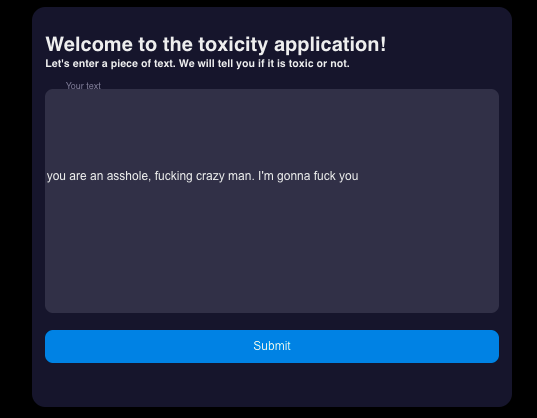
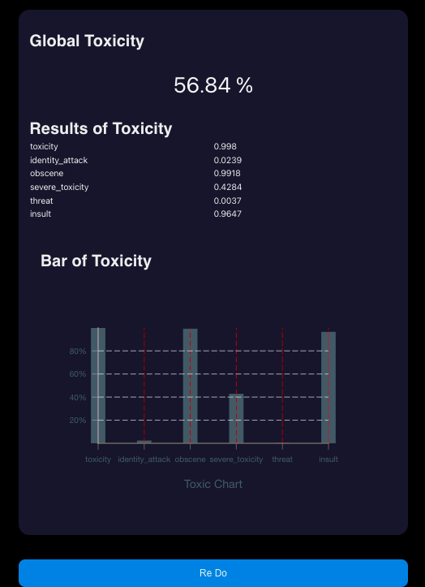
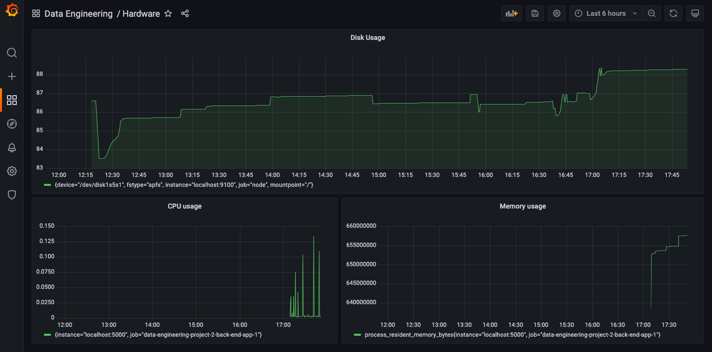
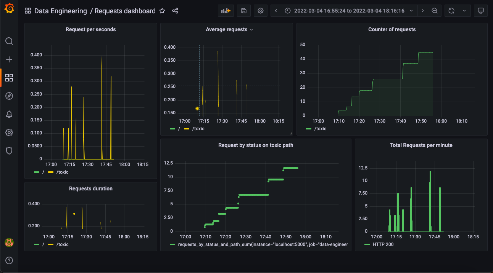
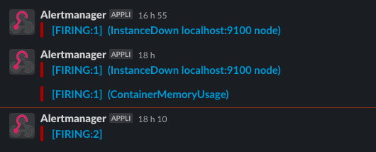

Authors: Chloé CARAYON - Cécile SPATZ  
Date: 6th March 2022
---

# Data Engineering II Final Project

Welcome to Toxic evaluator, this project aims to develop data engineering and development skills.  
The application is a toxicity monitor, where the user inputs a piece of text, and the application should be able to infer if the text is toxic or not.


## Table of contents
1. [Example](#example)
2. [Getting Start](#getting_start)
3. [Application](#application)
    1. [Toxic Model](#toxic_model)
    2. [Back-end](#back-end)
    3. [Front-end](#front-end)
    4. [Application Package](#application_package)
4. [Technical Requirements](#technical_requirements)
    1. [Task Manager](#task_manager)
    2. [Testing](#testing)
    3. [Automation](#automation)
    4. [DockerHub Containarisation](containarization)
    5. [Prometheus Monitoring](#monitoring)
        1. [Monitoring Dashboard, Grafana](#monitoring_dashboard)
        2. [Alert Manager and Slack](#alert_slack)
    6. [Server on local, Ngrok](#ngrok)

## 1. Example   <a name="example"></a>
The application is as followed, one has to enter a text in the input panel:   


And the application returns its toxicity:  


## 2. Getting Start  <a name="getting_start"></a>

This application is divided in two parts, a back-end and a front-end.

In order to run this project, one can clone the repository and run:
``` 
 docker-compose -f docker-compose.yml up -d 
```
This will run the two containers of front-end and back-end. 

Or you can directly use the image of the [front-end](https://hub.docker.com/repository/docker/carayonchloe/data-engineering-project-2-front-end) 
and [back-end](https://hub.docker.com/repository/docker/carayonchloe/data-engineering-project-2-back-end) from Dockerhub.


## 3. Application <a name="application"></a> 
### 3.1. Toxic Model <a name="toxic_model"></a> 
The model used is the ``` Detoxify('original') ``` from  https://huggingface.co/unitary/toxic-bert

### 3.2. Back-end <a name="back_end"></a> 
The Back-end has been developed in Python Flask.

To learn more about Back-end, check the [Readme](https://github.com/C2-Gang/Data-Engineering-Project-2/blob/master/back-end/Readme.md) file.
In order to visualize back-end go to: http://localhost:5000/

### 3.3. Front-end <a name="front_end"></a> 
The Front-end has been developed in Reactjs.

To learn more about Front-end, check the [Readme](https://github.com/C2-Gang/Data-Engineering-Project-2/blob/master/front-end/Readme.md) file.
In order to visualize front-end go to: http://localhost:3006/

### 3.4. Application package  <a name="application_package"></a> 

In order to run this project, one can clone the repository and run:
``` 
 docker-compose -f docker-compose.yml up -d 
```

## 4. Technical Requirements   <a name="technical_requirements"></a> 
### 4.1. Task Manager <a name="task_manager"></a> 

In order to work on this project, we decide to use Jira. 
One can look at our Kanban Table at https://cecilespatz.atlassian.net/jira/software/projects/DEP2/boards/4

### 4.2. Testing <a name="testing"></a> 

One can find the different tests:
- For [back-end](https://github.com/C2-Gang/Data-Engineering-Project-2/blob/master/back-end/app/tests/test.py) 
- For [front-end](https://github.com/C2-Gang/Data-Engineering-Project-2/tree/master/front-end/src/tests)   
Those tests are executed during docker build.

### 4.3. Automation  <a name="automation"></a> 
The JenkinsFile is available [at](https://github.com/C2-Gang/Data-Engineering-Project-2/blob/master/Jenkinsfile).
In the environment section
``` 
environment {
        BRANCH = "your_branch"
    }
```
You have to specify each time the BRANCH, you are working on and want to merge on release.   
You also have to modify the Jenkins Pipeline Configuration with the corresponding BRANCH.

### 4.4. Dockerhub Containarization <a name="containarization"></a> 

The docker images are available on DockerHub.  
- For [back-end](https://hub.docker.com/repository/docker/carayonchloe/data-engineering-project-2-back-end) 
- For [front-end](https://hub.docker.com/repository/docker/carayonchloe/data-engineering-project-2-front-end) 

### 4.5. Prometheus Monitoring <a name="monitoring"></a> 

In order to monitor our application, we use prometheus. 
The configuration file is available at [prometheus.yml](https://github.com/C2-Gang/Data-Engineering-Project-2/blob/master/prometheus/prometheus.yml) 

#### 4.5.1. Monitoring Dashboard: Grafana  <a name="monitoring_dashboard"></a>

In order to monitor our application, we defined two specific dashboards on grafana. 
On the prometheus file, you have to specify our ```$GRAFANA_USERNAME ``` and ```$GRAFANA_PASSWORD ```.

- The Hardware Dashboard [json model](https://github.com/C2-Gang/Data-Engineering-Project-2/blob/master/grafana/hardware-model.json)   
This dashboard evaluates CPU usage, memory usage, and disk space usage.



- The Software Dashboard [json model](https://github.com/C2-Gang/Data-Engineering-Project-2/blob/master/grafana/requests-model.json)   
This dashboard evaluates requests per seconds, counts the number of requests, the request status, etc...   


#### 4.5.2. Alert Manager and Slack <a name="alert_slack"></a>

We defined rules with prometheus [rules.yml](https://github.com/C2-Gang/Data-Engineering-Project-2/blob/master/prometheus/rules.yml).   
Those alerts are handle by the alert manager [alertmanager.yml](https://github.com/C2-Gang/Data-Engineering-Project-2/blob/master/prometheus/alertmanager.yml). 
We configure the alertmanager with Slack in order to receive the alerts on a specific open channel.  
In order to use it on Slack as well, please configure your API URL and specify it on the alertmanager.yml at ``` $API_URL ```

The alerts are the following:
- Alert when an instance is down
- Alert before running out of memory 
- Alert when cpu usage is very high
- Alert when code raises an exception, an error

The alerts are displayed as follows on Slack:   



### Server on local  <a name="ngrok"></a>
If you want to play with this application, you can run ngrok by using th configuration file [here](https://github.com/C2-Gang/Data-Engineering-Project-2/blob/master/ngrok/ngrok.yml)
